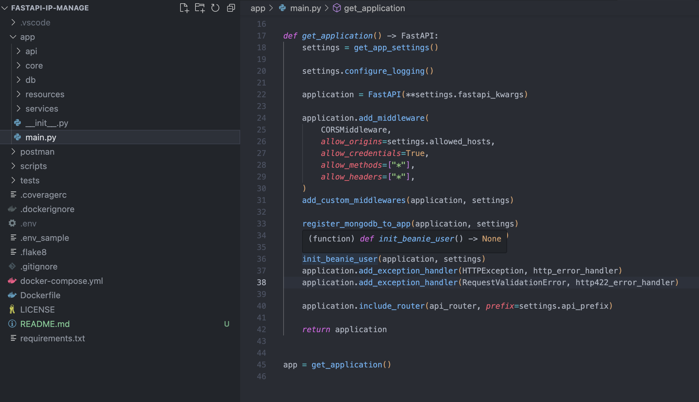

# :zap: fastapi-ip-manage
<a name="readme-top"></a>


  <div align="center">

  <p>
    一个使用FastAPI构建的高效、规范、强大的IP数据管理系统后端部分，可作为框架学习和新项目脚手架使用。
  </p>
  <div align="center">
  
</div>

</div>

## :page_facing_up: 项目介绍


`fastapi-ip-manage` 是一个使用 [FastAPI](https://fastapi.tiangolo.com/) 搭建的 IP 后台管理系统，作为前后端分离项目的后端部分。项目采用 RESTful 风格 API，并广泛使用了 FastAPI 的各种特性。这个系统不仅集成了 JWT, Pydantic, Pymongo, FastAPI-users, Loguru 等库，而且还包含了 PEP 8 自动检测和格式化脚本，适合作为练手项目或新项目的脚手架。

## :star2: 特性

- **FastAPI**: 提供快速、高效的 API 开发。
- **FastAPI Cache**: 用于缓存处理。
- **Loguru**: 简化日志管理。
- **Motor**: 异步数据库驱动。
- **FastAPI-users**: 简化用户管理和认证。
- **Isort, Autoflake, Flake8**: 用于代码格式化和质量控制。

## :rocket: 开始

要在本地启动和运行这个项目，请按照以下步骤操作：

1. 克隆仓库：
   ```bash
   git clone https://github.com/your-github/fastapi-ip-manage.git
   ```
2. 安装依赖：
   ```bash
   pip install -r requirements.txt
   ```
3. 创建环境变量文件并编辑
   ```bash
   cp .env_sample .env
   ```
4. 仅启动fastapi服务:
    ```bash
    uvicorn app.main:app --reload
    ```
5. 检查代码格式:
   ```bash
   bash scripts/lint 
   ```
6. 自动pep8规范格式化代码:
   ```bash
   bash scripts/format 
   ```

7. 使用docker-compose快速部署项目：
    ```bash
    docker-compose up -d
    ```

## :gem: 致谢

感谢以下库和工具在 `fastapi-ip-manage` 项目中的支持和帮助：

- **[FastAPI](https://fastapi.tiangolo.com/)**: 用于构建高效、快速的 API。
- **[FastAPI Cache](https://github.com/long2ice/fastapi-cache)**: 提供缓存机制，优化性能。
- **[Loguru](https://github.com/Delgan/loguru)**: 简化的日志记录工具，提升开发体验。
- **[Motor](https://motor.readthedocs.io/)**: 异步 MongoDB 驱动程序。
- **[FastAPI-users](https://github.com/fastapi-users/fastapi-users)**: 用于用户认证和管理的工具。
- **[Isort](https://github.com/PyCQA/isort)**: 代码排序工具，用于维护导入的一致性和清晰度。
- **[Autoflake](https://github.com/myint/autoflake)**: 用于移除未使用的导入和变量。
- **[Flake8 6.0.0](https://github.com/PyCQA/flake8)**: 代码风格和质量检查工具。

这些工具的集成不仅提高了开发效率，也确保了代码的可读性和质量。
